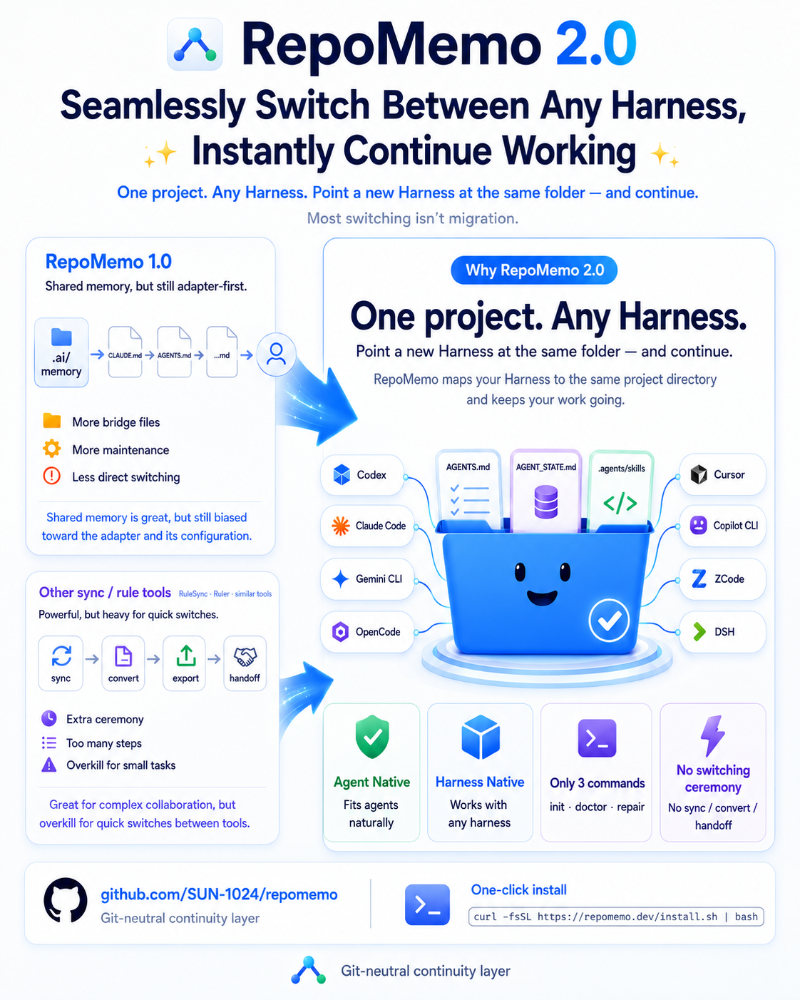

# RepoMemo

> **Languages:** **English** · [简体中文](./README.zh.md)

**Initialize once. Keep working. Switch Agent Harnesses without conversion.**

RepoMemo makes a new or already-in-progress project **Agent Native** and
**Harness Native**. It keeps durable rules, current progress, and reusable
Skills in the project itself, so Codex, Claude Code, Gemini CLI, OpenCode,
Cursor, Copilot CLI, ZCode, and DeepSeek Harness can work from the same sources.



## Why RepoMemo 2.0

RepoMemo 1.0 supported fewer Harnesses and needed more manual setup. Rule-sync
and converter tools solve a different, heavier problem: mapping many
Harness-specific configurations back and forth. That can be useful for a large
migration, but it adds conversion steps, drift, and failure points to the much
more common workflow of opening an existing project in another coding agent for
one focused task.

RepoMemo 2.0 chooses a smaller contract:

- **Initialize once:** adopt a new project or a project already in progress.
- **Keep one durable project truth:** rules, handoff state, and Skills stay with
  the project instead of one Harness session.
- **Switch by opening the same folder:** point the next supported Harness at the
  project and continue; there is no per-switch conversion command.
- **Use only three commands:** `init`, `doctor`, and `repair` cover adoption,
  diagnosis, compatible upgrades, and safe recovery.

That is the practical meaning of **Agent Native** and **Harness Native** here:
native shared files first, the thinnest necessary compatibility bridge second,
and no conversion pipeline in the middle.

## Start in 30 seconds

Choose either route, then initialize RepoMemo inside any new or existing
project.

Without installing it globally:

```bash
cd my-project
npx repomemo@latest init
```

With Homebrew on macOS or Linux:

```bash
brew tap SUN-1024/repomemo
brew install repomemo
cd my-project
repomemo init
```

Then open the same directory with any supported Harness:

```bash
codex
# or: claude, gemini, opencode, cursor, copilot, zcode, dsh
```

That is the whole switching workflow. There is no RepoMemo `switch`, `sync`,
`convert`, `export`, or `handoff` command.

## Already halfway through a project?

Run the same `init` command in the existing project directory. RepoMemo keeps
the source tree, configuration, user-written rules, current state, and existing
Skills. It adds only the shared contract and required compatibility bridges.

Before switching, ask the current agent to record the real progress:

```text
Read AGENTS.md and update AGENT_STATE.md with the current goal,
completed work, validation, changed paths, and next action.
```

The next Harness opens the same directory, reads `AGENTS.md` and
`AGENT_STATE.md`, and continues. A Harness that was already running may need to
reload the project files or start a new session. Private chat history is not
portable; important context must be written into the project.

## The idea

- **Agent Harness** is the runtime or interface hosting the coding agent, such
  as Codex, Claude Code, Gemini CLI, or OpenCode.
- **Agent Native** means the project is a first-class home for agent-readable
  rules, state, and Skills. The project—not a private chat—is the durable unit.
- **Harness Native** means each Harness uses paths and formats it already
  supports. RepoMemo prefers native discovery and adds only a tiny bridge when
  a Harness requires one.

The principle is simple: **the project owns continuity; Harnesses are
replaceable entry points.** RepoMemo is not an agent launcher, wrapper, session
manager, or new Harness.

## Only three commands

```bash
# Add or safely upgrade RepoMemo in this project
repomemo init

# Read-only diagnosis
repomemo doctor

# Repair only safe RepoMemo-managed bridges and links
repomemo repair
```

Useful forms:

```bash
repomemo init --target path/to/project
repomemo doctor --harness claude
repomemo doctor --json
repomemo repair --harness claude
```

`doctor --repair` remains a compatibility alias for older scripts. A healthy
`doctor` report confirms the on-disk contract; it does not launch, authenticate,
upgrade, or approve workspace trust for a third-party Harness.

## Three shared sources

```text
my-project/
├── AGENTS.md              # durable project rules
├── AGENT_STATE.md         # current goal, progress, tests, and next action
├── .agents/skills/        # reusable Agent Skills
├── CLAUDE.md              # thin bridge when required
└── GEMINI.md              # thin bridge when required
```

You maintain the first three sources. RepoMemo owns only clearly marked blocks
and removes only obsolete aliases that point exactly to the canonical Skill
root. Text outside managed markers is preserved;
malformed or ambiguous markers fail closed instead of being overwritten.

## Install

### Homebrew (macOS or Linux)

If Homebrew is already available, it can install RepoMemo and its required
Node.js runtime:

```bash
brew tap SUN-1024/repomemo
brew install repomemo
```

Then run `repomemo init` inside your project. Later releases can be installed
with `brew update && brew upgrade repomemo`.

### One-click: no Node, npm, Git, or Homebrew required

macOS or Linux:

```bash
curl -fsSL https://raw.githubusercontent.com/SUN-1024/repomemo/main/install.sh | sh
```

Windows PowerShell:

```powershell
irm https://raw.githubusercontent.com/SUN-1024/repomemo/main/install.ps1 | iex
```

The installer uses an existing Node.js 22+ runtime when available. Otherwise it
downloads a private current Node.js LTS runtime (Node.js 24 at this release)
into the current user's directory, verifies the archive against Node.js
`SHASUMS256.txt`, installs RepoMemo without `sudo`, and adds its small binary
directory to the user `PATH`. It supports macOS Intel/Apple silicon, Windows
x64/ARM64, glibc Linux x64/ARM64, and musl Linux x64. It does not install or
require Git or Homebrew.

A base operating-system shell and downloader are still necessary: PowerShell on
Windows, or `sh` plus `curl`/`wget` on macOS and Linux. You may download and
inspect the script before running it instead of piping it directly to the shell.

### Mainland China one-click install

The China entrypoints try jsDelivr and GitHub delivery sources, then automatically
use the npmmirror Node.js binary mirror and `registry.npmmirror.com`; no npm
mirror setup is required. The base script is fully downloaded before execution,
so a failed download cannot be mistaken for a successful install.

macOS or Linux:

```bash
curl -fsSL https://cdn.jsdelivr.net/gh/SUN-1024/repomemo@main/install-cn.sh | sh

# wget alternative
wget -qO- https://cdn.jsdelivr.net/gh/SUN-1024/repomemo@main/install-cn.sh | sh
```

Windows PowerShell:

```powershell
irm https://cdn.jsdelivr.net/gh/SUN-1024/repomemo@main/install-cn.ps1 | iex
```

### Node.js package managers

No global installation:

```bash
npx repomemo@latest init
pnpm dlx repomemo@latest init
```

Permanent installation:

```bash
# npm
npm install --global repomemo

# npm with the China registry
npm install --global repomemo --registry=https://registry.npmmirror.com
```

The Node.js package-manager routes require Node.js 22 or newer. RepoMemo itself
has zero runtime dependencies. After installation, `init`, `doctor`, and
`repair` operate locally without Git or network calls.

## Upgrade without rebuilding the project

Run the latest `init` in the same working copy:

```bash
cd existing-project
npx repomemo@latest init
npx repomemo@latest doctor
```

Compatible upgrades update only RepoMemo-managed blocks and missing bridges.
They preserve source files, user-authored text, `AGENT_STATE.md`, and
`.agents/skills`. If a mid-project adoption finds an existing `.claude/skills`
or `.zcode/skills` directory with no name collision, it moves those entries
byte-for-byte into `.agents/skills`, then removes the empty obsolete path. Old
RepoMemo aliases that point exactly to the canonical root are also removed. A
name collision or foreign link fails closed with exact manual guidance.
Repeating `init` should report `0 change(s)`.

RepoMemo 2.0.3 stages obsolete aliases before changing managed text or adopting
Skills. If any stage fails, the earlier stages are rolled back and `repair
--json` still returns a structured error. Project initialization also refuses
filesystem roots, the user home directory, the active OS temporary directory,
and shared temporary roots such as `/tmp` and `/var/tmp`.

## Harness compatibility

`native` means direct Harness support. `bridge` means RepoMemo adds a minimal
import. `manual` means the imported project rules tell the Harness where to read
the canonical Skills, but the Harness does not list them in its native Skill
catalog. The registry and both README matrices are generated from
[`data/harnesses.json`](./data/harnesses.json).

<!-- repomemo:matrix:start -->
| Harness | Rules | Skills | Evidence | Version boundary |
|---|---|---|---|---|
| Codex | native | native | official-smoke | tested 0.151.0-alpha.7.2 |
| Claude Code | bridge | manual | official | docs only |
| Gemini CLI | bridge | native | official | docs only; requires >=0.26.0 |
| OpenCode | native | manual | provisional | tested 1.17.7 catalog limitation |
| Cursor | native | native | official | docs only |
| GitHub Copilot CLI | native | native | official | docs only |
| ZCode | native | native | official-smoke | tested CLI 0.16.5 / App 3.10.2 |
| DeepSeek Harness | native | native | source-verified | tested 0.1.2-alpha.4 |
<!-- repomemo:matrix:end -->

Claude Code currently catalogs project Skills only from `.claude/skills`, while
OpenCode, Cursor, and Copilot can also scan that path in addition to
`.agents/skills`. RepoMemo therefore does not create a `.claude/skills` alias:
doing so makes every Skill appear twice in those multi-path Harnesses. Claude
still imports `AGENTS.md` through `CLAUDE.md` and receives the instruction to
read applicable Skills from `.agents/skills`, which is reported honestly as
`manual` rather than native catalog discovery.

Because `.claude/skills` has several consumers, a scoped `doctor --harness
opencode`, `cursor`, or `copilot` diagnoses that obsolete path too; scoped
`repair` removes only an exact canonical alias. Independent directories and
foreign links remain fail-closed. Gemini native Skills require CLI 0.26.0 or
newer, as recorded in the generated version boundary; RepoMemo never executes a
third-party command to guess the installed version.

RepoMemo itself is Git-neutral. Some Harness versions may use `.git` or other
markers to choose a project root. Although current OpenCode documentation lists
project `.agents/skills`, installed OpenCode 1.17.7 did not catalog that path
without the duplicate `.claude` alias, even in a Git worktree. RepoMemo reports
OpenCode Skills as `manual` for this tested version and never runs `git init` on
the user's behalf.

## What RepoMemo deliberately does not do

- It does not copy or convert private chat sessions.
- It does not launch, install, authenticate, or configure Harnesses.
- It does not convert MCP, hooks, permissions, or Harness-private settings.
- It does not run Git, edit `.gitignore`, use the network, or execute Skill scripts.
- It never invents project progress or silently replace foreign content.

For the shortest walkthrough, see [RepoMemo in one minute](./QUICKSTART.md).
Version 1 users should read [MIGRATION-v1-v2.md](./MIGRATION-v1-v2.md).

## Development

```bash
pnpm install
pnpm verify
pnpm pack --pack-destination artifacts
pnpm package:smoke
pnpm entrypoint:smoke
pnpm installer:smoke
```

See [CONTRIBUTING.md](./CONTRIBUTING.md). CI covers macOS, Linux, Windows, and
Node.js 22/24.

## License

MIT
