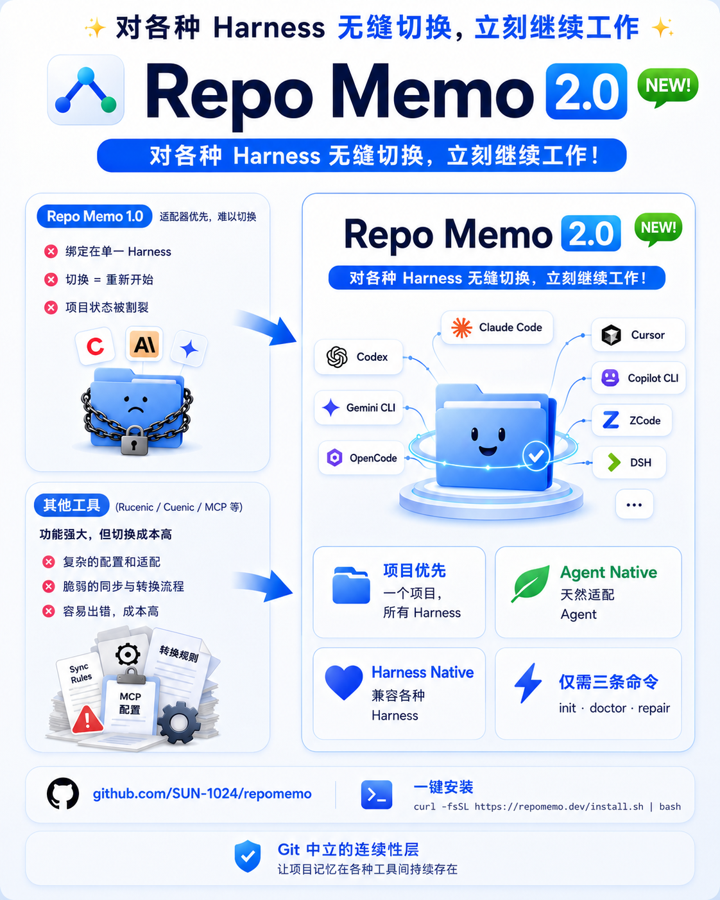

# RepoMemo

> **语言：** [English](./README.md) · **简体中文**

**初始化一次，继续开发，切换 Agent Harness 不需要转换。**

RepoMemo 可以让新项目或已经做到一半的项目成为 **Agent Native**、
**Harness Native** 的项目。规则、当前进度和可复用 Skills 都留在项目目录中，
Codex、Claude Code、Gemini CLI、OpenCode、Cursor、Copilot CLI、ZCode 和
DeepSeek Harness 可以读取同一套信息。



## 为什么是 RepoMemo 2.0

RepoMemo 1.0 支持的 Harness 较少，手工接入步骤也更多。Rule Sync、Converter
一类工具解决的是另一种更重的问题：在多套 Harness 私有配置之间反复映射和转换。
大型迁移有时确实需要它们，但对更常见的场景——临时换一个 Coding Agent，在现有
项目上修一个问题、补一点功能——转换规则、同步步骤和格式漂移反而增加了复杂度与
出错点。

RepoMemo 2.0 选择更小、更直接的契约：

- **只初始化一次：** 新项目和已经开发到一半的项目都能原地接入。
- **项目只保留一份持久事实：** 规则、交接状态和 Skills 跟着项目走，而不是困在
  某一个 Harness 的会话里。
- **切换就是打开同一个目录：** 把下一个受支持的 Harness 对准项目文件夹即可继续，
  每次切换都不需要 `convert`。
- **始终只有三个命令：** `init`、`doctor`、`repair` 覆盖接入、诊断、兼容升级与
  安全修复。

这就是这里所说的 **Agent Native** 与 **Harness Native**：优先使用大家原生支持的
共享文件，只在确有必要时加一层最薄的兼容桥，中间不再放一套转换流水线。

## 30 秒开始

在任何新项目或已有项目中运行一次：

```bash
cd 你的项目
npx repomemo@latest init
```

然后直接用任意受支持的 Harness 打开同一个目录：

```bash
codex
# 也可以：claude、gemini、opencode、cursor、copilot、zcode、dsh
```

切换流程到这里就结束了。RepoMemo 没有 `switch`、`sync`、`convert`、
`export` 或 `handoff` 命令。

## 项目已经做到一半了？

仍然在现有项目目录运行同一个 `init`。RepoMemo 会保留源码、配置、用户规则、
当前状态和已有 Skills，只补充共享契约与必要的兼容桥。

切换前，让当前 Agent 把真实进度写进项目：

```text
请读取 AGENTS.md，并把当前目标、已完成工作、验证结果、
修改路径和下一步写入 AGENT_STATE.md。
```

下一个 Harness 打开同一个目录，读取 `AGENTS.md` 和 `AGENT_STATE.md` 后即可
继续。如果 Harness 在执行 `init` 前就已经运行，可能需要让它重新读取项目文件
或新开一次会话。私有聊天历史不能自动搬运；重要上下文必须写回项目。

## 核心理念

- **Agent Harness**：承载 Coding Agent 的运行环境或交互入口，例如 Codex、
  Claude Code、Gemini CLI、OpenCode。
- **Agent Native**：项目天然包含 Agent 可以读取的规则、状态和 Skills。
  持久主体是项目，而不是某个私有聊天窗口。
- **Harness Native**：尽量使用各 Harness 已经原生支持的路径和格式；只有确实
  需要时，RepoMemo 才添加极薄的导入桥或本地链接。

一句话原则：**项目拥有连续性，Harness 只是可以替换的入口。** RepoMemo
不是 Agent 启动器、套壳、会话管理器，也不是另一个 Harness。

## 只有三个命令

```bash
# 接入项目，或安全升级已有 RepoMemo
repomemo init

# 只读诊断
repomemo doctor

# 只修复安全的 RepoMemo 托管桥和链接
repomemo repair
```

常用形式：

```bash
repomemo init --target path/to/project
repomemo doctor --harness claude
repomemo doctor --json
repomemo repair --harness claude
```

旧脚本仍可使用 `doctor --repair` 兼容别名。`doctor` 显示 healthy 代表磁盘文件
契约正确，不代表它已经启动、登录、升级或替第三方 Harness 完成 workspace trust。

## 三个共享源

```text
你的项目/
├── AGENTS.md              # 长期项目规则
├── AGENT_STATE.md         # 当前目标、进度、测试和下一步
├── .agents/skills/        # 可复用 Agent Skills
├── CLAUDE.md              # 必要时使用的极薄桥
└── GEMINI.md              # 必要时使用的极薄桥
```

用户只维护前三个共享源。RepoMemo 只管理带明确标记的区块，并且只移除精确指向
canonical Skill 根目录的旧别名。
托管标记外的文字保持不变；标记损坏或含义不明确时会安全停止，不猜测覆盖。

## 安装

### 一键安装：不要求 Node、npm、Git 或 Homebrew

macOS 或 Linux：中国大陆推荐直接使用中国镜像版：

```bash
curl -fsSL https://cdn.jsdelivr.net/gh/SUN-1024/repomemo@main/install-cn.sh | sh

# 没有 curl 但有 wget
wget -qO- https://cdn.jsdelivr.net/gh/SUN-1024/repomemo@main/install-cn.sh | sh
```

Windows PowerShell：中国大陆镜像版：

```powershell
irm https://cdn.jsdelivr.net/gh/SUN-1024/repomemo@main/install-cn.ps1 | iex
```

中国版会先在 jsDelivr 与 GitHub 脚本源之间自动回退，再使用 npmmirror 的
Node.js 二进制镜像和 `registry.npmmirror.com`，不需要用户手工配置 npm 镜像。
基础脚本会完整下载成功后才执行，下载失败不会被误报为安装成功。

安装器会优先复用本机 Node.js 22 或更高版本。如果电脑没有 Node/npm，它会
自动在当前用户目录安装一套隔离的当前 Node.js LTS/npm（本版本为 Node.js 24），使用
`SHASUMS256.txt` 校验下载文件，然后安装 RepoMemo 并加入用户 `PATH`。
支持 macOS Intel/Apple 芯片、Windows x64/ARM64、glibc Linux x64/ARM64 与
musl Linux x64。整个过程不需要 Git、Homebrew 或 `sudo`，也不会替换系统 Node。

操作系统仍需提供最基础的下载入口：Windows 使用 PowerShell；macOS/Linux
使用 `sh` 加 `curl` 或 `wget`。对安全要求较高时，可以先下载并检查脚本，再执行。

海外网络的一键入口：

```bash
# macOS / Linux
curl -fsSL https://raw.githubusercontent.com/SUN-1024/repomemo/main/install.sh | sh
```

```powershell
# Windows PowerShell
irm https://raw.githubusercontent.com/SUN-1024/repomemo/main/install.ps1 | iex
```

### 已有包管理器

无需全局安装：

```bash
npx repomemo@latest init
pnpm dlx repomemo@latest init
```

永久安装：

```bash
# npm
npm install --global repomemo

# npm 中国镜像
npm install --global repomemo --registry=https://registry.npmmirror.com

# Homebrew
brew tap SUN-1024/repomemo
brew install repomemo
```

包管理器安装方式需要 Node.js 22 或更高版本。RepoMemo 自身运行时依赖为零；
安装完成后，`init`、`doctor`、`repair` 都不会调用 Git 或网络。

## 已有项目直接升级

在同一个 working copy 中重新运行最新版 `init`：

```bash
cd 已有项目
npx repomemo@latest init
npx repomemo@latest doctor
```

兼容升级只更新 RepoMemo 托管区块和缺失的桥，保留源码、用户文字、
`AGENT_STATE.md` 和 `.agents/skills`。中途接入时，如果发现已有的
`.claude/skills` 或 `.zcode/skills` 目录且 Skill 名称不冲突，RepoMemo 会把其中
内容逐字节原地归并到 `.agents/skills`，然后移除已经清空的旧路径。旧版 RepoMemo
创建、且精确指向 canonical 根目录的别名也会被移除。名称冲突或外来链接会安全停止
并给出明确处理提示。再次执行 `init` 应显示 `0 change(s)`。

RepoMemo 2.0.2 会先暂存旧别名，再修改托管文字或归并 Skills；任一阶段失败都会回滚
前序阶段，`repair --json` 仍返回结构化错误。初始化还会拒绝文件系统根、用户主目录、
当前操作系统临时目录，以及 `/tmp`、`/var/tmp` 等共享临时根。

## Harness 兼容性

`native` 表示 Harness 原生读取；`bridge` 表示 RepoMemo 添加极小的导入；
`manual` 表示导入后的项目规则会告诉 Harness 去哪里读取 canonical Skills，但这些
Skills 不会进入该 Harness 的原生 Skill catalog。兼容注册表与中英文矩阵统一由
[`data/harnesses.json`](./data/harnesses.json) 生成。

<!-- repomemo:matrix:start -->
| Harness | Rules | Skills | Evidence | Version boundary |
|---|---|---|---|---|
| Codex | native | native | official-smoke | tested 0.151.0-alpha.7.2 |
| Claude Code | bridge | manual | official | docs only |
| Gemini CLI | bridge | native | official | docs only; requires >=0.26.0 |
| OpenCode | native | manual | provisional | tested 1.17.7 catalog limitation |
| Cursor | native | native | official | docs only |
| GitHub Copilot CLI | native | native | official | docs only |
| ZCode | native | native | official-smoke | tested CLI 0.16.5 / App 3.10.2 |
| DeepSeek Harness | native | native | source-verified | tested 0.1.2-alpha.4 |
<!-- repomemo:matrix:end -->

Claude Code 当前只会从 `.claude/skills` 原生建立项目 Skill catalog；OpenCode、
Cursor 和 Copilot 也可能在 `.agents/skills` 之外扫描该路径。因此 RepoMemo 不再
创建 `.claude/skills` 别名，否则每个 Skill 都会在这些多路径 Harness 中出现两次。
Claude 仍会通过 `CLAUDE.md` 导入 `AGENTS.md`，并收到从 `.agents/skills` 按需读取
Skill 的指示；矩阵将这一能力诚实标为 `manual`，不冒充原生 catalog 发现。

由于 `.claude/skills` 有多个消费者，定向执行 `doctor --harness opencode`、`cursor`
或 `copilot` 时也会诊断这个旧路径；定向 `repair` 只删除精确指向 canonical 根的别名，
独立目录和外来链接仍然 fail closed。Gemini 原生 Skills 要求 CLI 0.26.0 或更高版本，
该下界记录在生成矩阵中；RepoMemo 不会执行第三方命令来猜测本机版本。

RepoMemo 本身保持 Git-neutral。个别 Harness 版本仍可能依赖 `.git` 或其他标记
判断项目根。虽然 OpenCode 当前文档列出了项目级 `.agents/skills`，但本机实测的
OpenCode 1.17.7 即使在 Git working tree 中，也没有在移除重复 `.claude` 别名后
建立该目录的 catalog。因此该版本在矩阵中诚实标为 `manual`；RepoMemo 也不会擅自
替用户执行 `git init`。

## RepoMemo 明确不做什么

- 不复制或转换各 Harness 的私有聊天会话。
- 不启动、安装、登录或配置 Harness。
- 不转换 MCP、hooks、权限或 Harness 私有设置。
- 不运行 Git、不修改 `.gitignore`、不联网、不执行 Skill 脚本。
- 不猜写项目进度，也不静默覆盖外来内容。

最短教程见[一分钟用上 RepoMemo](./QUICKSTART.zh.md)。v1 用户请阅读
[MIGRATION-v1-v2.md](./MIGRATION-v1-v2.md)。

## 开发

```bash
pnpm install
pnpm verify
pnpm pack --pack-destination artifacts
pnpm package:smoke
pnpm entrypoint:smoke
pnpm installer:smoke
```

参见 [CONTRIBUTING.md](./CONTRIBUTING.md)。CI 覆盖 macOS、Linux、Windows
以及 Node.js 22/24。

## License

MIT
